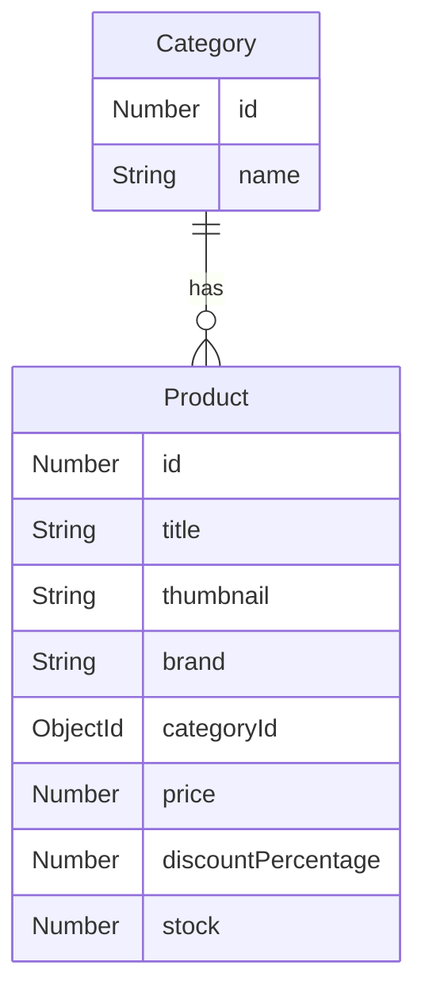

# Nuxt Minimal Starter

```bash
#Frontend
npm install
npm run dev

#Backend (make sure it set .env file)
cd backend
npm install
npm run dev
```

## Database Structure


```mermaid
erDiagram   
    Category {
        Number id
        String name
    }
    Product {
        Number id
        String title
        String thumbnail
        String brand
        ObjectId categoryId
        Number price
        Number discountPercentage
        Number stock
    }
    Category ||--o{ Product : has
```
